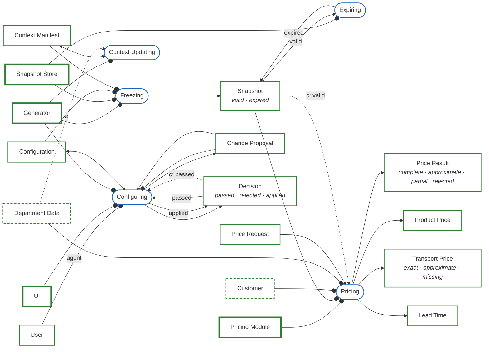
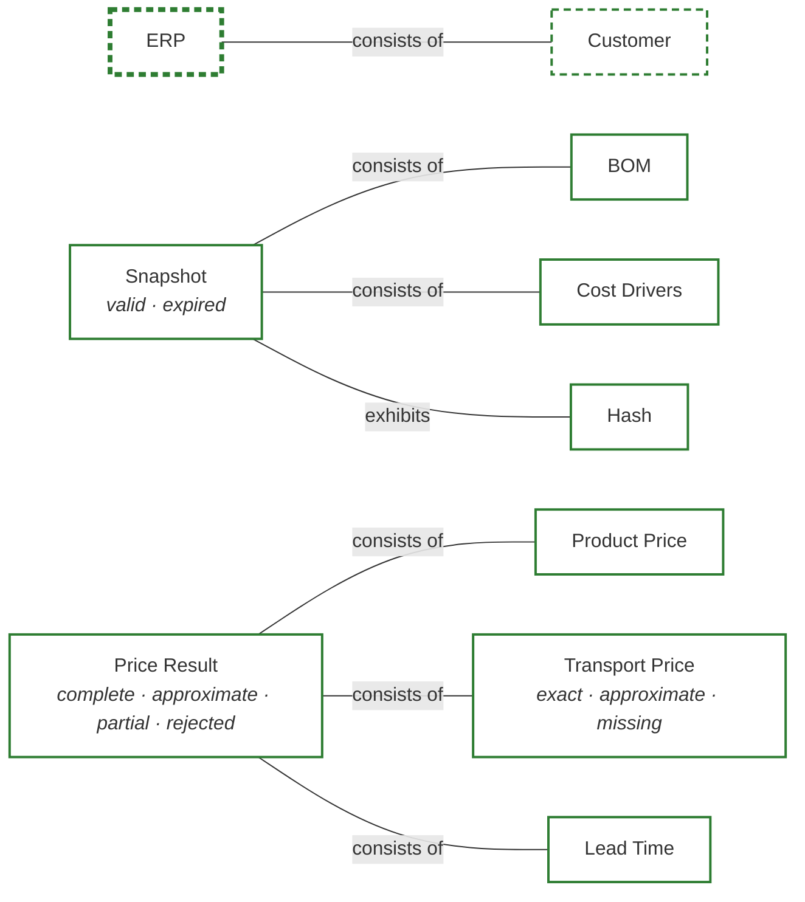
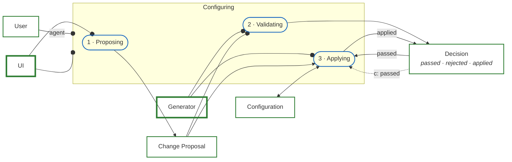
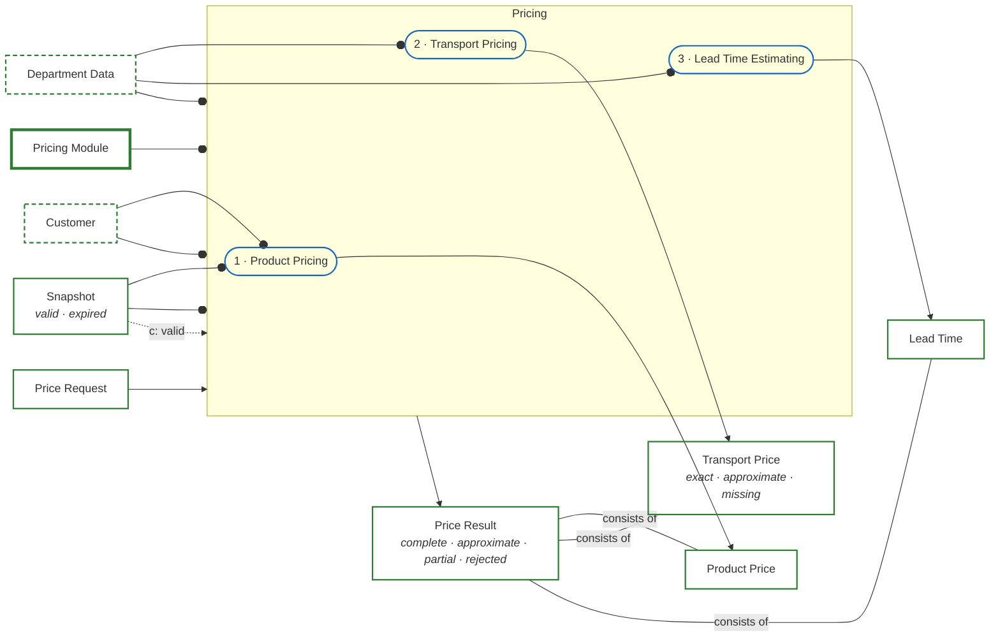
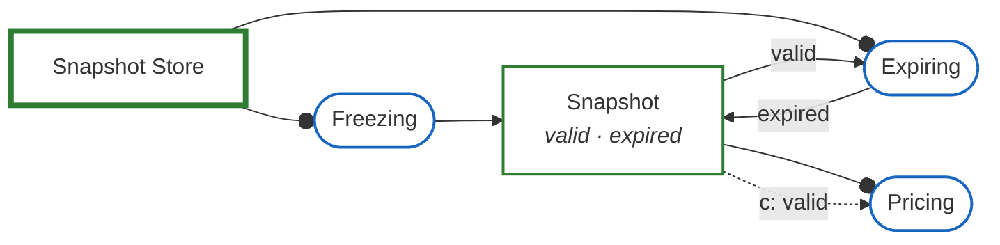
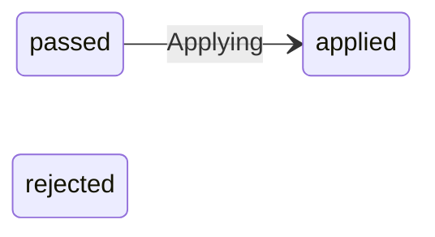
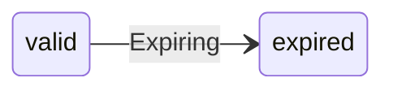
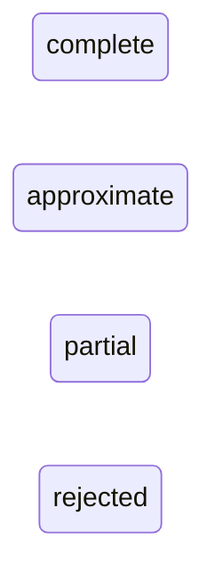
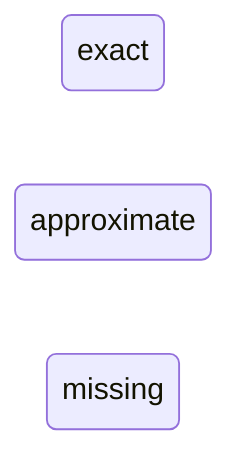

# Window configuration and pricing

A user configures a window, the generator freezes the configuration into a snapshot, and the pricing module prices the snapshot with data from the ERP and other departments.

Generated from the OPM model. Edit the model file, not this document.

## Window configuration and pricing: system view

## Structure

## Configuring

## Pricing

## Snapshot lifecycle

## Modules

| Module | Performs | Takes | Gives | Changes |
|---|---|---|---|---|
| UI | Configuring, Proposing | none | Change Proposal | none |
| Generator | Validating, Applying, Context Updating, Freezing | Change Proposal, Configuration, Context Manifest | Decision, Snapshot | Configuration, Decision, Context Manifest |
| Snapshot Store | Freezing, Expiring | Configuration, Context Manifest | Snapshot | Snapshot |
| Pricing Module | Pricing | Price Request, Snapshot, Customer, Department Data | Price Result | none |
| ERP | none | none | none | none |

## Object states

### Decision

### Snapshot

### Price Result

### Transport Price

## OPL

- UI, Generator, Snapshot Store, Pricing Module and ERP are modules.
- User is physical.
- ERP is environmental.
- ERP consists of Customer.
- Customer is environmental.
- Department Data is environmental.
- Decision can be passed, rejected or applied.
- Snapshot can be valid or expired.
- Snapshot consists of BOM and Cost Drivers.
- Snapshot exhibits Hash.
- Price Result can be complete, approximate, partial or rejected.
- Price Result consists of Product Price, Transport Price and Lead Time.
- Transport Price can be exact, approximate or missing.
- User handles Configuring.
- Configuring requires UI.
- Configuring zooms into Proposing, Validating and Applying, in that sequence.
- Proposing requires UI.
- Proposing yields Change Proposal.
- Validating requires Generator and Change Proposal.
- Validating yields Decision.
- Applying requires Generator.
- Applying consumes Change Proposal.
- Applying affects Configuration.
- Applying changes Decision from passed to applied.
- Applying occurs if Decision is passed, otherwise Applying is skipped.
- Context Updating requires Generator.
- Context Updating affects Context Manifest.
- Department Data initiates Context Updating.
- Freezing requires Generator, Snapshot Store, Configuration and Context Manifest.
- Freezing yields Snapshot.
- Expiring requires Snapshot Store.
- Expiring changes Snapshot from valid to expired.
- Pricing requires Pricing Module, Snapshot, Customer and Department Data.
- Pricing consumes Price Request.
- Pricing yields Price Result.
- Pricing occurs if Snapshot is valid, otherwise Pricing is skipped.
- Pricing zooms into Product Pricing, Transport Pricing and Lead Time Estimating, in that sequence.
- Product Pricing requires Snapshot and Customer.
- Product Pricing yields Product Price.
- Transport Pricing requires Department Data.
- Transport Pricing yields Transport Price.
- Lead Time Estimating requires Department Data.
- Lead Time Estimating yields Lead Time.
